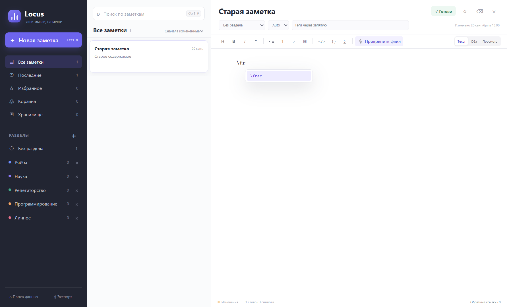
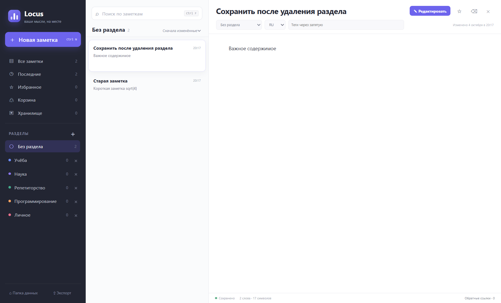

# Locus Notes

Locus Notes — локальное desktop-приложение для структурированных заметок, Markdown и LaTeX.

Текущая стабильная версия: **v1.3.0**. Windows x64. Интерфейс на русском языке. Лицензия MIT.

## Возможности

- Локальные Markdown-заметки: разделы, теги, избранное, поиск и wiki-ссылки.
- Предпросмотр с таблицами, подсветкой кода и формулами KaTeX.
- Подсказки для 33 команд LaTeX с управлением клавиатурой и мышью.
- Язык заметки: Auto, русский или английский. Это метаданные, а не перевод интерфейса.
- Удаление раздела с подтверждением: заметки сохраняются в «Без раздела».
- Корзина с восстановлением, безвозвратным удалением и очисткой.
- Хранилище: обзор использования диска и очистка неиспользуемых вложений.
- Вложения, перетаскивание файлов и вставка изображений из буфера.
- Прокрутка длинных заметок внутри рабочей области с неподвижными sidebar и элементами управления.
- Автосохранение, ежедневные локальные backups и экспорт активных заметок с вложениями.
- Установщик и portable для Windows.

Хранилище показывает использование диска и инструменты очистки; отдельного архива заметок нет.

## Скриншоты

Используются только искусственные тестовые заметки.




## Установка

Скачайте файлы со страницы **Releases** этого репозитория.

| Вариант | Файл | Как запустить |
| --- | --- | --- |
| Установщик Windows | `Locus-Notes-Setup-1.3.0-x64.exe` | Запустите установщик и выберите папку установки. |
| Portable | `Locus-Notes-Portable-1.3.0-x64.exe` | Запустите файл без установки. |

Portable использует обычную пользовательскую папку данных: заметки не хранятся рядом с exe. Сборки не подписаны; Windows может показать SmartScreen. Сверяйте SHA-256 с контрольными суммами релиза.

## Начало работы

**Новая заметка** или Ctrl+N создаёт заметку; **Редактировать** открывает редактор, **Готово** — предпросмотр.

Для формул используйте `$...$` и `$$...$$`. При вводе префикса вроде `\fr` появляются подсказки. ↑/↓ выбирают команду, Enter или Tab вставляют её, Escape закрывает список. Аргументы вводятся самостоятельно.

Auto / RU / EN сохраняет язык заметки. Кнопка × рядом с пользовательским разделом удаляет его после подтверждения, сохраняя заметки в **Без раздела**. Системные представления удалить нельзя.

Ctrl+F — поиск, Ctrl+K — быстрый переход, Ctrl+S — сохранение.

## Данные и приватность

Данные находятся в системной папке пользователя **Документы/Locus Notes**, отдельно от репозитория и установки. `LOCUS_DATA_DIR` меняет расположение; для разработки выбирайте отдельную папку вне репозитория.

```text
Locus Notes/
  notes/        Markdown с метаданными YAML
  attachments/  Вложения
  trash/        Восстановимые удалённые заметки
  backups/      Ежедневные копии и снимки удаления разделов
  config.json   Разделы и конфигурация
```

Профиль Electron, кэш и логи находятся в обычных системных пользовательских папках. Логи могут содержать локальные пути: удаляйте их перед публикацией.

Облачной синхронизации, аккаунтов, телеметрии, аналитики и автообновления нет. Сохранение локальное. Приложение не изолировано от сети: внешние изображения Markdown могут делать запросы, Chromium может скачивать словари проверки орфографии, HTTP(S)-ссылки открываются в браузере. Для автономной работы избегайте внешних изображений.

Файлы **не зашифрованы**. Защищайте папку данных средствами ОС.

- Удаление заметки перемещает её в Корзину. Безвозвратное удаление и очистка требуют подтверждения.
- Удаление раздела сохраняет заметки и вложения, включая заметки в Корзине.
- Для полной резервной копии закройте приложение и скопируйте всю папку данных.
- Экспорт включает активные заметки, вложения и конфигурацию, но не Корзину и историю backups.

Старые заметки без поля языка читаются как `auto` без массовой перезаписи.

## Разработка

Требования: Windows x64, Node.js **22.12+**, npm. Проверки и сборки выполнены на Windows.

```sh
npm ci
npm run dev
```

Проверки из `package.json`:

```sh
npm run typecheck
npm test
npm run test:e2e
npm run test:regression-ui
npm run test:release-ui
```

Electron-проверки запускайте последовательно. Они открывают временные окна с искусственными данными и отдельными профилями Chromium.

## Сборка

```sh
npm run build
npm run dist
```

Production-код создаётся в `out/`. `npm run dist` собирает установщик и portable Windows x64 в `release/`. Только portable: `npm run dist:portable`.

После сборки `npm run test:e2e:packaged` и `npm run test:packaged` проверяют распакованное production-приложение. Дополнительные UI-проверки: [RELEASE_CHECK.md](RELEASE_CHECK.md).

Lockfile фиксирует зависимости. Процесс сборки повторяемый; побайтовая идентичность exe с временными метками или подписями не гарантируется.

## Релиз и участие

[История изменений](CHANGELOG.md) · [Текст релиза](docs/releases/v1.3.0.md) · [Проверки](RELEASE_CHECK.md) · [Аудит публикации](docs/PUBLICATION_AUDIT.md) · [Порядок публикации](docs/PUBLISHING.md).

Для изменений есть [CONTRIBUTING.md](CONTRIBUTING.md). URL репозитория не указан в metadata, пока не известен настоящий адрес.

## Лицензия

[MIT License](LICENSE). Зависимости сохраняют собственные лицензии: [THIRD_PARTY_NOTICES.md](THIRD_PARTY_NOTICES.md).
